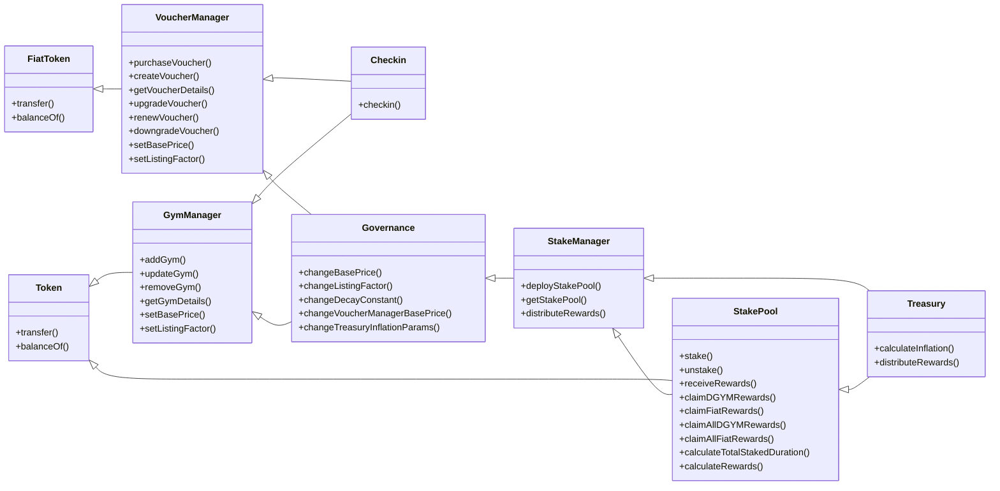

### DeGym Smart Contract System

This document provides a comprehensive overview of the smart contract system and the reward program in DeGym. It highlights the key improvements made in version 2, the modular structure of the contracts, and the inflation mechanism used to calculate rewards. The UML diagram provides a visual representation of the relationships between the contracts, making it easier to understand the system's architecture.

## Overview

This system consists of six primary smart contracts that handle the management of DeGym tokens, staking, vouchers, gym listings, check-ins, and governance.

## Contracts

### Token.sol
- **Purpose**: Manages the issuance and transfer of DGYM tokens.
- **Key Functions**:
  - `transfer`: Transfers DGYM tokens from one account to another.
  - `balanceOf`: Retrieves the balance of DGYM tokens for a specific account.
- **Key Events**:
  - `Transfer`: Emitted when tokens are transferred from one account to another.

### VoucherManager.sol
- **Purpose**: Manages the issuance and management of vouchers (NFTs).
- **Key Functions**:
  - `purchaseVoucher`: Allows users to purchase vouchers using fiat tokens.
  - `upgradeVoucher`: Upgrades a voucher to a higher tier.
  - `renewVoucher`: Renews a voucher for an additional duration.
  - `downgradeVoucher`: Downgrades a voucher to a lower tier.
  - `getVoucherDetails`: Retrieves details of a specific voucher.
  - `setBasePrice`: Sets the base price for vouchers.
  - `setListingFactor`: Sets the listing factor for gyms.
- **Key Events**:
  - `VoucherPurchased`: Emitted when a voucher is purchased.
  - `VoucherUpgraded`: Emitted when a voucher is upgraded.
  - `VoucherRenewed`: Emitted when a voucher is renewed.
  - `VoucherDowngraded`: Emitted when a voucher is downgraded.

### Checkin.sol
- **Purpose**: Manages the check-in process using vouchers and triggers payment.
- **Key Functions**:
  - `checkin`: Allows users to check in to gyms using their vouchers.
  - Validates if the tier of the voucher matches with the tier of the gym.
  - Ensures that the gym accepts the fiatToken of the given voucher.
  - Checks the eligibility of the gym based on the staked amount.
- **Key Events**:
  - `CheckinSuccessful`: Emitted when a check-in is successful.

### GymManager.sol
- **Purpose**: Manages gym catalog, CRUD operations for gyms, and validates gym stakes based on counterpart stakes.
- **Key Functions**:
  - `addGym`: Adds a gym with a specific tier, geolocation, metadata, and acceptable fiat tokens.
  - `updateGym`: Updates the details of an existing gym.
  - `removeGym`: Removes a gym from the catalog.
  - `getGymDetails`: Retrieves details of a specific gym.
  - Validates gym registration based on the owner's staked DGYM amount (base_price * 50 per gym listed).
  - `listGym`: Lists a gym with a specific tier and staked amount.
  - `setRegisteringFactor`: Sets the listing factor for gyms.
- **Key Events**:
  - `GymAdded`: Emitted when a new gym is added.
  - `GymUpdated`: Emitted when a gym is updated.
  - `GymRemoved`: Emitted when a gym is removed.

### StakeManager.sol
- **Purpose**: Manages the deployment of stakeholder-specific bond pools and staking parameters.
- **Key Functions**:
  - `deployBondPool`: Deploys a stakeholder-specific bond pool contract.
  - `getBondPool`: Retrieves the address of a stakeholder-specific bond pool.
  - `updateRewards`: Distributes rewards based on the total weight of all bonds.
  - `updateAbsTotalStaked`: Updates the total staked amount across all bond pools.
  - `updateAbsTotalBondWeight`: Updates the total weight of all bonds across all bond pools.
  - `updateAbsTotalClaimableRewards`: Updates the total claimable rewards across all bond pools.
  - `updateMaxDuration`: Updates the maximum duration for staking.
  - `updateAbsTotalEarnings`: Updates the total earnings across all bond pools.
  - `getAbsMaxRemainDuration`: Retrieves the maximum remaining duration for staking.
- **Key Events**:
  - `BondPoolDeployed`: Emitted when a user-specific stake pool is deployed.
  - `AbsStakeUpdated`: Emitted when the total staked amount is updated.
  - `RewardsUpdated`: Emitted when rewards are distributed.
  - `MaxRemainDurationUpdated`: Emitted when the maximum remaining duration is updated.
  - `AbsTotalBondWeightUpdated`: Emitted when the total bond weight is updated.

### BondPool.sol
- **Purpose**: Manages the staking and reward distribution for a specific stakeholder.
- **Key Functions**:
  - `bond`: Allows the user to create a new bond with a specified amount, lock duration, and compound setting.
  - `unbond`: Allows the user to unbond their tokens after the lock duration has passed.
  - `increaseBondAmount`: Increases the amount of an existing bond.
  - `extendLockDuration`: Extends the lock duration of an existing bond.
  - `claimRewards`: Claims the rewards for a specific bond.
  - `switchCompoundStatus`: Switches the compound status of a specific bond.
  - `calculateWeight`: Calculates the weight of a bond based on the amount and lock duration.
  - `updateReward`: Updates the reward distribution for all bonds in the pool.
- **Key Events**:
  - `Bonded`: Emitted when a new bond is created.
  - `Unbonded`: Emitted when a bond is unbonded.
  - `RewardUpdated`: Emitted when rewards are updated.
  - `RewardClaimed`: Emitted when rewards are claimed.
  - `BondAmountIncreased`: Emitted when the amount of a bond is increased.
  - `LockDurationExtended`: Emitted when the lock duration of a bond is extended.
  - `CompoundStatusSwitched`: Emitted when the compound status of a bond is switched.

### Treasury.sol
- **Purpose**: Manages the distribution of multiple fiat tokens and DGYM inflation.
- **Key Functions**:
  - `addFiatToken`: Adds a new fiat token to the treasury.
  - `depositFiatRewards`: Deposits fiat token rewards into the treasury.
  - `distributeRewards`: Distributes DGYM and fiat token rewards to user stake pools.
  - `setDecayConstant`: Sets the decay constant for inflation calculation.
- **Key Events**:
  - `FiatTokenAdded`: Emitted when a new fiat token is added to the treasury.
  - `FiatRewardsDeposited`: Emitted when fiat rewards are deposited into the treasury.
  - `RewardsDistributed`: Emitted when rewards are distributed to user stake pools.

### Governance.sol
- **Purpose**: Manages governance over base prices, listing factors, and staking parameters.
- **Key Functions**:
  - `changeBasePrice`: Allows changing the base price for vouchers and gym listings.
  - `changeListingFactor`: Allows changing the listing factor for gyms.
  - `changeDecayConstant`: Allows changing the decay constant for staking.
  - `changeVoucherManagerBasePrice`: Allows changing the base price for specific voucher managers (e.g., USDT).
  - `changeTreasuryInflationParams`: Allows changing the inflation parameters and constants for the Treasury contract.
- **Key Events**:
  - `BasePriceChanged`: Emitted when the base price for vouchers or gym listings is changed.
  - `ListingFactorChanged`: Emitted when the listing factor for gyms is changed.
  - `DecayConstantChanged`: Emitted when the decay constant for staking is changed.
  - `VoucherManagerBasePriceChanged`: Emitted when the base price for specific voucher managers is changed.
  - `TreasuryInflationParamsChanged`: Emitted when the inflation parameters and constants for the Treasury contract are changed.

## Inflation Mechanism

### Inflation Rate Calculation
The inflation rate is dynamically calculated based on the remaining supply ratio and a decay constant. The formula used is:

inflation_rate = decay_constant × ((max_supply−current_supply​)/max_supply)

Where:
- `decay_constant` is 0.8.
- `current_supply` is the total supply of DGYM at the time of calculation.
- `max_supply` is 10,000,000,000 DGYM.

### Weighted Stakes Calculation
The reward distribution is calculated based on the staked amount and the lock duration using the following formulas:

duration_weights=[log(duration+1) for stake, duration in users]
weighted_stakes=[stake×weight for (stake, duration), weight in zip(users, duration_weights)]weighted_stakes=[stake×weight for (stake, duration), weight in zip(users, duration_weights)]
total_weighted_stake=∑(weighted_stakes)total_weighted_stake=∑(weighted_stakes)

Each user's share and reward:
rewards=[(stake,duration,weight,weighted_stake,weighted_stake/total_weighted_stake×total_rewards) for (stake, duration), weight, weighted_stake in zip(users, duration_weights, weighted_stakes)]rewards=[(stake,duration,weight,weighted_stake,weighted_stake/total_weighted_stake×total_rewards) for (stake, duration), weight, weighted_stake in zip(users, duration_weights, weighted_stakes)]

## UML Diagram

